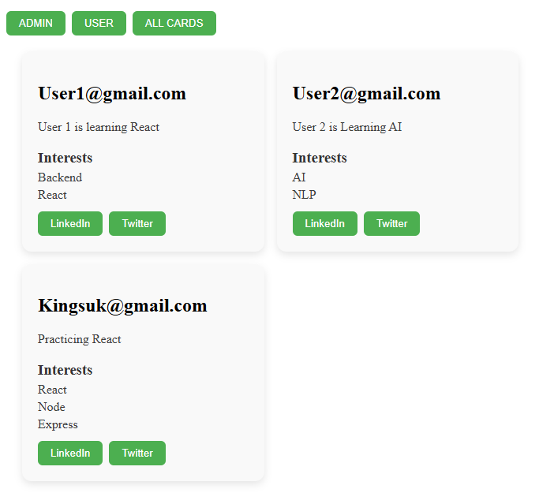
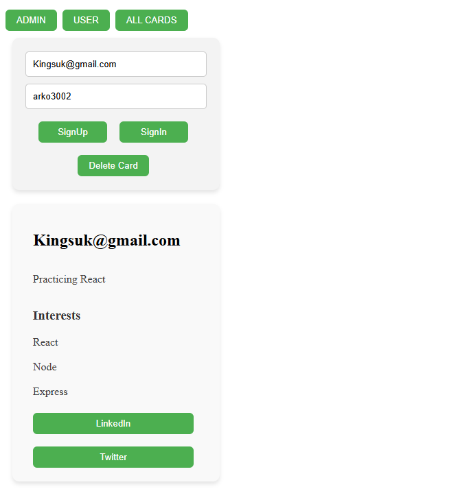
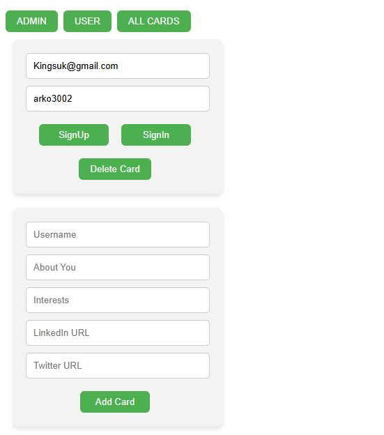
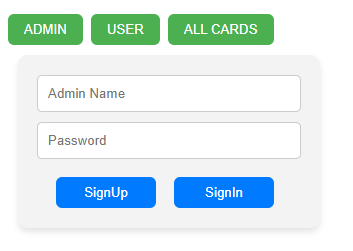
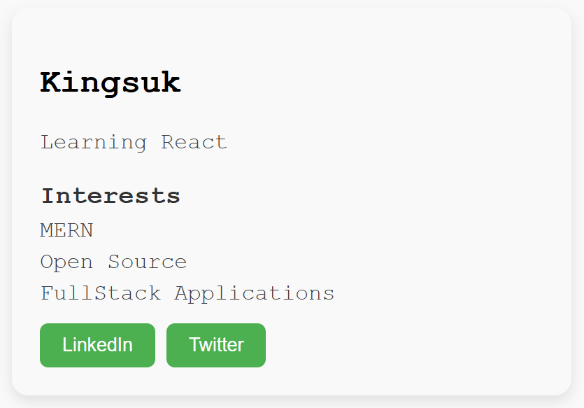

# ⚛ Simple React E-Business Card App

This is a React-based E-Business Card app with a reusable Card component. Each card displays a person's name, description, social media handles, and interests. Additionally, there's an admin page to create, update, and delete cards via a backend server.

---

## 🚀 Features

### 🧩 Card Component

- Reusable and customizable via props.
- Displays:
  - Full Name
  - Short Bio / Description
  - Social Media Links (LinkedIn, Twitter, etc.)
  - Interests Section

### 🛠 Advanced Features
- (Visit the advanced Folder in this repo)
- **Admin Dashboard**: Delete Cards via a form after Signin.
- **User Dashboard**: Add/Delete Cards via a form & Signin/Signup.
- **Backend Integration**:
  - Node.js + Express backend.
  - MongoDB database with jwt.
  - Full CRUD operations.
- **Frontend Admin Controls**:
  - React-based UI with form validation and status feedback.
  - Admin-only privileges (can be extended to include authentication).

---

---

## 🖼 Previews

Below are a few example previews of the Card component:

| Card Site | User & His Card | Add Card | Admin Site |
|----------|-----------|-----------|-----------|
|  |  |  |  |

---

## 🛠 Tech Stack

- **Frontend**: React, TailwindCSS / CSS Modules
- **Backend**: Node.js, Express
- **Database**: MongoDB (via Mongoose)

---
## Simple Version
- (Without Backend)
- Simple Card Component

## 💡 Future Improvements

- UI improvements.
- Fix Small Bugs.
- Work more for authentication.
- Do Validation Checks using ZOD.
- Update the db schema to display name just like in the Simple Version.

---
